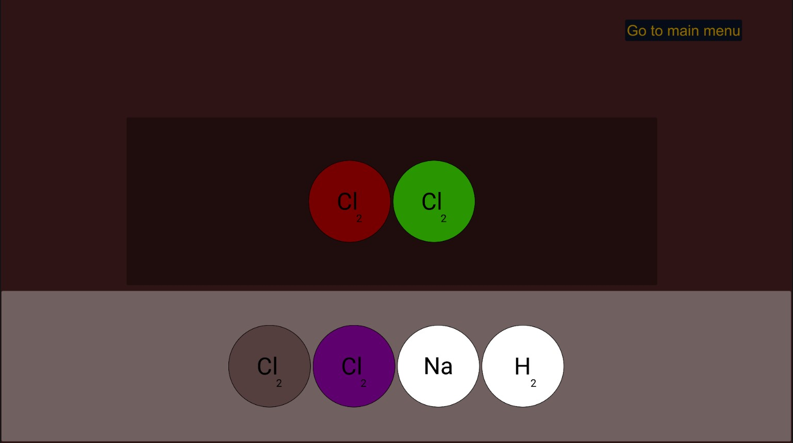

# Chemistry-Project-2.0

This project aims to help people with making and balancing chemical reactions.

## Features
### Chemical Reactions
- Combine basic molecules to create chemical compounds

- Balance chemical equations *(not implemented yet)*

### User Interface
Chose between two interfaces
- Table Top 
- *(not implemented yet)*

Periodic table style menu to choose and add elements to hand *(not implemented yet)*

Information about chosen element can be shown with a right click *(not implemented yet)*
